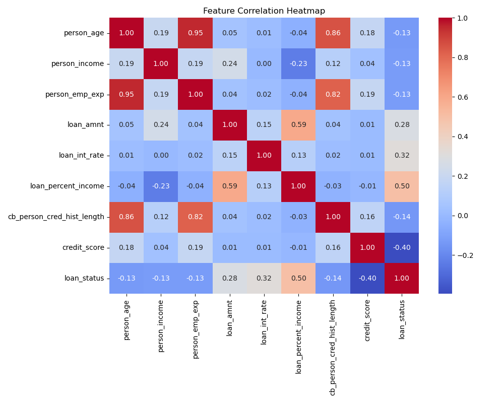
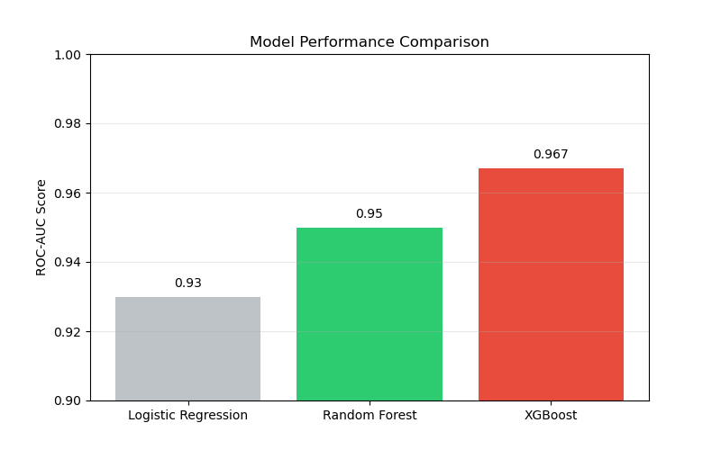

# Loan Prediction using Machine Learning


A comprehensive machine learning project for predicting loan default risk using customer financial and demographic data. This project implements multiple ML models with hyperparameter tuning and deploys the best model as a web service using Flask and Docker.

**Live Demo:**

- **Render:** [https://loan-prediction-kkvh.onrender.com](https://loan-prediction-kkvh.onrender.com)
- **Hugging Face:** [https://huggingface.co/spaces/TheManuAI/loan-prediction](https://huggingface.co/spaces/TheManuAI/loan-prediction)

## 1. Problem Description

**Business Context:**
Financial institutions face significant risks when approving loans. Lending to borrowers who may default can result in substantial financial losses. Conversely, rejecting creditworthy applicants leads to lost revenue opportunities.

**Problem Statement:**
This project aims to predict whether a loan applicant is likely to default (`loan_status = 1`) or repay (`loan_status = 0`) based on their financial profile. By automating this risk assessment, institutions can make faster, data-driven decisions, reduce default rates, and optimize their lending portfolios.

**Solution:**
We developed a machine learning model analyzing features like income, credit score, loan intent, and home ownership to predict default probability. The solution is deployed as a web service for real-time predictions.

## 2. Dataset

The dataset contains **45,000 records** with the following key features:

- **Demographics**: Age, Gender, Education, Employment Experience.
- **Financials**: Income, Home Ownership, Credit Score, Credit History Length.
- **Loan Details**: Amount, Intent, Interest Rate, Percent of Income.
- **Target**: `loan_status` (0 = Approved, 1 = Default).

**Source**: [Loan Approval Classification Data (Kaggle)](https://www.kaggle.com/datasets/taweilo/loan-approval-classification-data)

## 3. Exploratory Data Analysis (EDA)

Extensive EDA was conducted to identify risk factors and understand data distributions.

**Key Insights:**

- **Target Distribution**: The dataset is imbalanced, with ~66% of loans approved and ~34% defaulting.

- **Risk Factors**:

  - **Credit Score**: Strong negative correlation with default risk. Lower scores indicate higher risk.
  - **Income**: Lower income brackets show higher default rates.
  - **Loan-to-Income Ratio**: Ratios > 0.4 significantly increase risk.
  - **Home Ownership**: Renters have a higher default probability than homeowners.

  

_See `notebook.ipynb` for detailed analysis and visualizations._

## 4. Model Training

We experimented with multiple algorithms to find the best performer:

1.  **Logistic Regression**: Baseline model. Good interpretability but lower accuracy.
2.  **Random Forest**: Ensemble method. Better performance but prone to overfitting without tuning.
3.  **XGBoost Classifier**: Gradient boosting. Superior performance and handles imbalanced data well.

**Model Comparison:**



### Feature Importance

Understanding which features drive the model's decisions is crucial.

### Final Model: XGBoost Classifier

Selected for its superior **ROC-AUC (~0.965)** and robust performance across metrics.

**Hyperparameters Tuned:**

- `n_estimators`: 50
- `max_depth`: 3
- `learning_rate`: 0.2
- `subsample`: 0.6
- `colsample_bytree`: 0.9
- `min_child_weight`: 1

**Final Metrics:**

- **Accuracy**: ~93%
- **Precision**: ~0.91
- **Recall**: ~0.88
- **F1-Score**: ~0.89
- **ROC-AUC**: ~0.965

The training logic is exported to `train.py` for reproducibility.

## 5. Project Structure

```
.
├── notebook.ipynb            # EDA, feature engineering, and model experiments
├── train.py                  # Script to train and save the final model (xgb_model.pkl)
├── predict.py                # Script to load model and test predictions
├── app.py                    # Flask web application for serving predictions
├── requirements.txt          # Project dependencies
├── Dockerfile               # Docker configuration for containerization
├── loan_data.csv            # Dataset file
├── xgb_model.pkl            # Trained XGBoost model artifact
├── dv.pkl                   # DictVectorizer artifact
└── static/ and templates/                 # Flask static and template files
```

## 6. Installation & Reproducibility

Follow these steps to reproduce the project locally:

1.  **Clone the repository**:

    ```bash
    git clone https://github.com/TheManuAi/Loan-Prediction-using-ML.git
    cd Loan-Prediction-using-ML
    ```

2.  **Set up Virtual Environment**:

    ```bash
    # Create venv
    python -m venv venv

    # Activate venv
    # On Linux/Mac:
    source venv/bin/activate
    # On Windows:
    # venv\Scripts\activate
    ```

3.  **Install Dependencies**:
    ```bash
    pip install -r requirements.txt
    ```

## Usage

1.  **Train the Model**:
    Run the training script to generate the model artifacts (`xgb_model.pkl` and `dv.pkl`).

    ```bash
    python train.py
    ```

2.  **Test Prediction**:
    Run a sample prediction to verify the model works.
    ```bash
    python predict.py
    ```

## Model Deployment

The model is served via a **Flask API**.

**Run Locally**:

```bash
python app.py
```

Access the web interface at `http://localhost:5000`.

## 7. Containerization

The application is containerized using Docker for consistent deployment.

**Build Image**:

```bash
docker build -t loan-prediction .
```

**Run Container**:

```bash
docker run -p 5000:5000 loan-prediction
```

The app will be available at `http://localhost:5000`.

## 8. Cloud Deployment

The project is deployed and live on the following platforms:

- **Render**: [https://loan-prediction-kkvh.onrender.com](https://loan-prediction-kkvh.onrender.com)
- **Hugging Face**: [https://huggingface.co/spaces/TheManuAI/loan-prediction](https://huggingface.co/spaces/TheManuAI/loan-prediction)

## Results

| Model               | ROC-AUC (Test) | Status       |
| ------------------- | -------------- | ------------ |
| Logistic Regression | ~0.93          | Baseline     |
| Random Forest       | ~0.95          | Strong       |
| **XGBoost**         | **~0.965**     | **Selected** |

The final XGBoost model provides a robust balance of precision and recall, making it suitable for automated risk assessment in a real-world scenario.
